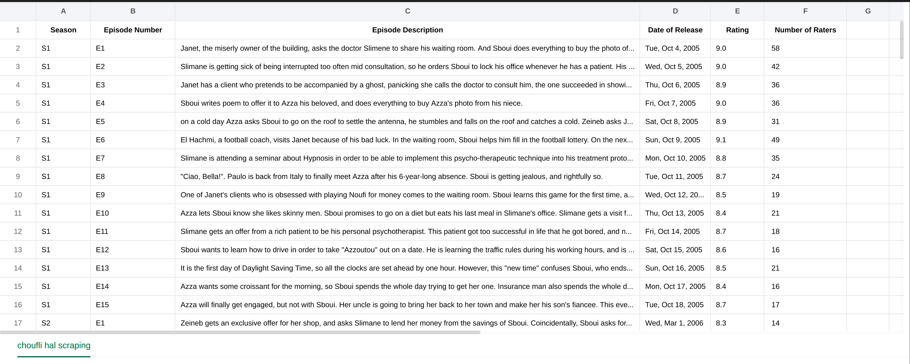

# 🎬 Choufli Hal IMDB Scraper  

This project is a **web scraper** that extracts episode details of **Choufli Hal** from IMDB and saves them into an Excel file.  

## 🛠 Installation  

1. **Install dependencies**  
     run the requirments.txt file:

    pip install -r requirements.txt

## 🚀 Usage

2.**Run the script to start scraping:**

python3 scraperIMDB.py

After execution, you will find the dataset saved as chouflihal_episodes.xlsx.
## 📂 Output Example

The extracted data is stored in an Excel sheet with the following columns:

## 📢 Note

I created this project for learning purposes. Feel free to use it, adapt it, or contribute as needed!

